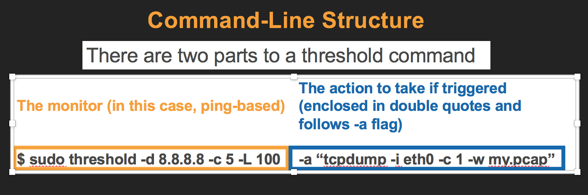

# threshold
A simple tool which allows you to set up a packet-loss/latency, TCP-handshake, or HTTP/HTTPs file transfer monitor against a network host. The monitor will execute a user-defined action if it detects failure to the host.
 
- [Installation](#installation)
- [Command-Line Structure](#structure)
- [Parameters](#parameters)
- [Examples and Scenarios](#examples)
- [Tips and Best Practices](#tips)
 

## Installation
\# *From Linux or Mac OS terminal download the source code from Github* 
`wget https://github.com/secureoptions/threshold/raw/master/threshold-3.1.tar.gz` 

\# *Unpack and change into installation directory* 
`tar -xvzf threshold-3.1.tar.gz` 
`cd threshold-3.1/` 

\# *Run the installation script* 
`sudo ./install` 

\# *Verify installation* 
`threshold --version` 

 
<a name="structure">
   
## Command Structure

 
<a name="parameters">
   
## Parameters
__-a | --action__ 
   The user-defined action to take if the threshold monitor is triggered. This can be just about any command that you can execute from a linux system CLI.

__-b | --backoff__  
   Default is 60. Only used when specifying a http:// or https:// as target host (-d). This is the interval in seconds between consecutive download tests. It is sometimes needed if a target webserver throttles consecutive web requests from the same source.

__-c | --count__ 
   Default is 3. The number of *consective* pings that must fail before the threshold monitor is considered to be in a failed state. If used with TCP handshakes (-P), it's the number of consecutive handshakes that must fail before the monitor is considered in a failed state. 

__-d | --destination__ 
   The target host IP or DNS hostname that you want to monitor. If this host becomes unresponsive for the parameters you define, then the action (-a "<ACTION>") is taken. __Important Note:__ if you use a prefix of http:// or https:// in the destination, this will create a download monitor which checks the actual download transfer time against the timeout (-t) that you have defined. If the download transfer time exceeds the timeout, then the monitor is considered in a failed state.

__-i | --interval__ 
   Default is 5. The interval in seconds at which you want to send out individual ping packets. If used with TCP (-P), the interval in seconds that TCP handshakes will be initiated.

__-k | --kill__ 
   Use to kill either a specific threshold monitor job (ie. threshold -k 3509) or kill ALL jobs (ie. threshold -k)

__-l | --list__ 
   List the active threshold monitor jobs

__-L | --latency__ 
   The maximum latency in milliseconds that a ping monitor can *average*. A ping monitor's average is calculated based on the number of pings it uses (-c). Therefore, its average latency reading is more accurate with the higher number of pings it's configured to use.

__-o | --logging__ 
   User-defined log location for threshold. This is logging for threshold monitoring (not to be confused with *action* output). Default location is /var/log/threshold.log

__-p | --persist__ 
    When setting this argument, your threshold monitor will remain persistent even if it has failed once. In this scenario, the monitor will execute the action you define, and then start itself again with same job parameters. 

__-P | --port__ 
   The TCP port that will be used to establish TCP handshakes on. Using this flag will also cause threshold to use a TCP-handshake monitor rather than a ping monitor. 

__-t | --timeout__ 
   Default is 1. The time in seconds to wait for a response back to ping or TCP SYN/ACK from target. If used with (-P) then timeout is not only the amount of time to wait for response for TCP SYN/ACK, but also the time to wait before sending FIN on successful TCP connections.

__-u | --uninstall__ 
   Uninstall threshold from your system. This will also stop any current jobs you have running.

__-v | --version__ 
   The current version of threshold
    
__-6 | --ipv6__ 
   Uses ipv6 rather than ipv4.
 
 
<a name="examples">
   
## Use cases and examples
__(Example: Setting a ping monitor)__ Client machines have been experiencing sporadic connection timeouts when trying to SSH into a linux server (192.168.3.10). You suspect potential packet loss or high latency somewhere in the network. For troubleshooting you choose to use MTR to check the network path when the issue occurs again (credits:https://github.com/traviscross/mtr). MTR will run from one of the impacted client's machines:

    sudo threshold -c 5 -L 50 -d 192.168.3.10 -a "mtr -r -c 100 192.168.3.10 >> mtr-results.txt" -p
   
The above example sets a simple ping monitor against (-d) *192.168.3.10*. If the host fails to respond to 5 consecutive pings (-c) __*OR*__ if the average latency of the 5 pings exceed 50ms (-L), the MTR tool will execute with its own arguments (-a), etc.

__(Example: Setting a TCP handshake monitor)__ After troubleshooting some application issues, you noticed that you are getting occasional connection timeouts between your app server and database, "mydb.organization.org" (SQL/TCP 1433). You want to determine if this problem is due to a network issue or perhaps something higher up the stack. A packet capture with tcpdump may be appropriate at the next occurence of the issue (credits:http://www.tcpdump.org/):

    sudo threshold -c 6 -d mydb.organization.org -P 1433 -a "tcpdump -i eth0 host mydb.organization.org -c 10 -w db_capture.pcap" -p
    
 The above example will continually monitor TCP handshakes with *mydb.organization.org*. Aside from default values used, if this destination fails to respond to 6 consecutive handshake attempts (-c) on TCP port 1433 (-P) then a tcpdump packet capture will run and export results to a wireshark-readable file (-a). Note that setting the -P argument here is the only factor that tells threshold to use TCP handshakes instead of pings
 
 __(Example: Setting an HTTP/HTTPS file transfer monitor)__ You noticed that when downloading content from your webserver to your workstation, it sometimes takes longer than expected. From your particular network it usually takes about 5 minutes to complete a 100MB, but lately this is less frequently the case.

 Since previous ping and TCP-handshake monitors have come back clean, you decided that using a HTTP file transfer monitor in conjunction with an iperf3 test (the *action*) would be appropriate here. The iperf3 test will give you an idea of the raw throughput capabilities of your network the next time the issue occurs (credits: https://iperf.fr/iperf-download.php)

    sudo threshold -d http://mywebserver.com/some/100MBfile.zip -t 300 -b 10 -a "iperf3 -c mywebserver.com -time 300 --logfile iperf3-results.txt" -p
    
Aside from default values, the above monitor will download a "100MBfile.zip" file from mywebserver.com. The download must complete in 5min or 300 seconds (-t). If this time is exceeded, the iperf3 action will be taken (-a). The interval between downloads is every 10 seconds (-b). 

Note that threshold will know that it should use downloads as monitor rather than ping and TCP handshakes since you have prefixed the host with *http://*, telling it that it's monitoring a webserver. 

 
<a name="tips">
   
## Tips for successful monitoring
1) Make sure monitors will not fail immediately upon starting them. For example, make sure you can actually ping *example.com* before setting up a monitor against it

2) If you use system variables (ie. $HOME), be sure to enclose the action in double quotes ("") and escape the variable (ie. \$HOME)

3) Don't make the monitors too aggressive. There is a good chance they will fail based on a false alarm

4) Don't make the monitors too tolerant. You could miss critical events. To balance too aggressive vs. too tolerant, research and understand as much about the issue as you can prior to configuring a monitor.

5) Consider setting up multiple types of monitoring against one destination, with multiple criteria, settings and actions (followup analysis). This is helpful when you don't know which layer an issue is happening at.
